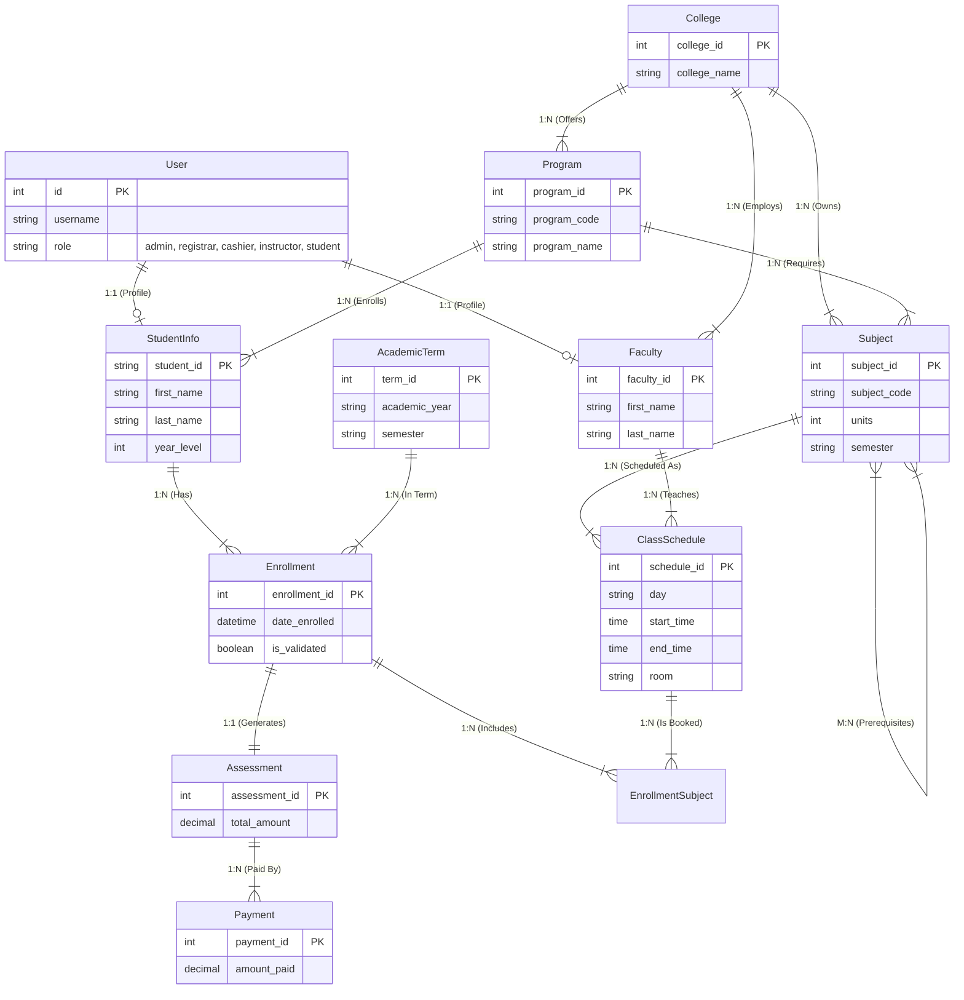

# Tandikan System Technical Documentation

## 1. System Overview
The Tandikan System is a Django-based Enrollment and School Management System designed to handle the academic operations of an educational institution. It supports multiple user roles including Administrators, Registrars, Faculty, Cashiers, and Students.

## 2. Feature Set

### 2.1. User Roles & Permissions
The system utilizes a custom User model with role-based access control (RBAC).
*   **Administrator**: Full system access.
*   **Registrar**: Academic record management.
*   **Cashier**: Financial transaction management.
*   **Instructor (Faculty)**: Class management and grading.
*   **Student**: Self-service enrollment and record viewing.

### 2.2. Key Features by Role

#### **Administrator**
*   **Dashboard**: System-wide metrics and quick links.
*   **User Management**: Create and manage accounts for Registrars, Faculty, and Staff.
*   **College & Program Management**: CRUD operations for Colleges and Academic Programs.
*   **Room Management**: Manage physical classroom inventory.

#### **Registrar**
*   **Student Management**: Admit new students, update student profiles.
*   **Subject Management**: Manage subject catalog and prerequisites.
*   **Class Scheduling**: Create class schedules, assign instructors and rooms.
*   **Enrollment Management**: Override enrollment for students.

#### **Faculty**
*   **My Schedule**: View assigned teaching load.
*   **Class Lists**: View students enrolled in their classes.
*   **Grading**: (Planned/Implied) Input grades for students.

#### **Student**
*   **Student Dashboard**: View current load, financial status, and announcements.
*   **Online Enrollment**: Self-service enrollment for the active term.
    *   Filter subjects by Program and Semester.
    *   Validation of prerequisites and schedule conflicts.
*   **My Schedule**: View personal class schedule.
*   **Enrollment History**: View past enrollments and Certificates of Registration (COR).

#### **Cashier**
*   **Payment Processing**: Record tuition payments.
*   **Assessment Validation**: Validate enrollments upon payment.

## 3. Technical Architecture

### 3.1. Stack
*   **Framework**: Django 5.x (Python)
*   **Database**: SQLite (Development) / MySQL or PostgreSQL (Production ready)
*   **Frontend**: Django Templates, Bootstrap 5, Jinja2 syntax.
*   **Styling**: Custom CSS + Tabler Icons.

### 3.2. Project Structure
*   `tandikan_python/`: Project configuration root.
*   `tandikan_website/`: Main application app.
    *   `models.py`: Database schema definitions.
    *   `views.py`: Business logic and request handling.
    *   `urls.py`: URL routing.
    *   `services/`: Business logic layer (e.g., `enrollment.py`, `assessment.py`).
    *   `templates/`: HTML templates organized by role/feature.

## 4. Database Design (ERD & Cardinality)

### 4.1. Entity Relationship Diagram (Mermaid)

### 4.2. Data Dictionary & Cardinality

| Entity A | Relationship | Entity B | Cardinality | Description |
| :--- | :--- | :--- | :--- | :--- |
| **User** | has profile | **StudentInfo** | 1:1 | A User account is linked to exactly one Student profile. |
| **User** | has profile | **Faculty** | 1:1 | A User account is linked to exactly one Faculty profile. |
| **College** | offers | **Program** | 1:N | A College can have multiple Programs (e.g., CCS offers CS, IT). |
| **Program** | has students | **StudentInfo** | 1:N | A Student belongs to one Program. |
| **Subject** | has schedule | **ClassSchedule** | 1:N | A Subject (e.g., Math101) can have multiple schedules (sections). |
| **Faculty** | teaches | **ClassSchedule** | 1:N | An Instructor can teach multiple classes. |
| **Student** | enrolls in | **Enrollment** | 1:N | A Student has one Enrollment record per Academic Term. |
| **Enrollment** | contains | **ClassSchedule** | M:N | Implemented via `EnrollmentSubject` join table. An Enrollment has many Subjects; a Class Schedule has many Students. |
| **Enrollment** | has | **Assessment** | 1:1 | Each Enrollment generates exactly one financial Assessment. |
| **Assessment** | has | **Payment** | 1:N | An Assessment can be paid in multiple installments (Payments). |
| **Subject** | requires | **Subject** | M:N | Self-referential. A subject can have multiple prerequisites. |

### 4.3. Constraints & Logic
*   **Unique Enrollment**: A student can only have one `Enrollment` record per `AcademicTerm` (`unique_together = ('student', 'term')`).
*   **Schedule Conflicts**: The system prevents:
    *   **Instructor Conflict**: An instructor cannot be in two places at the same time.
    *   **Room Conflict**: A room cannot host two classes at the same time.
    *   **Student Conflict**: A student cannot enroll in overlapping schedules.
*   **Prerequisites**: Students cannot enroll in a subject if they haven't passed the prerequisite (logic enforced in service layer).
